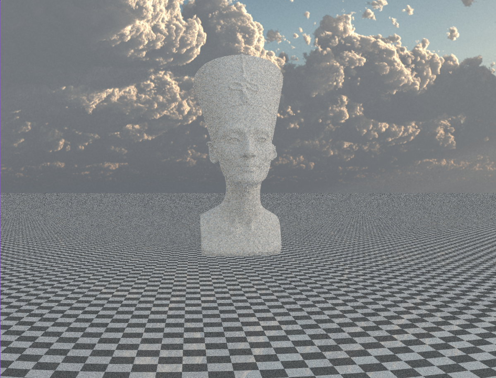
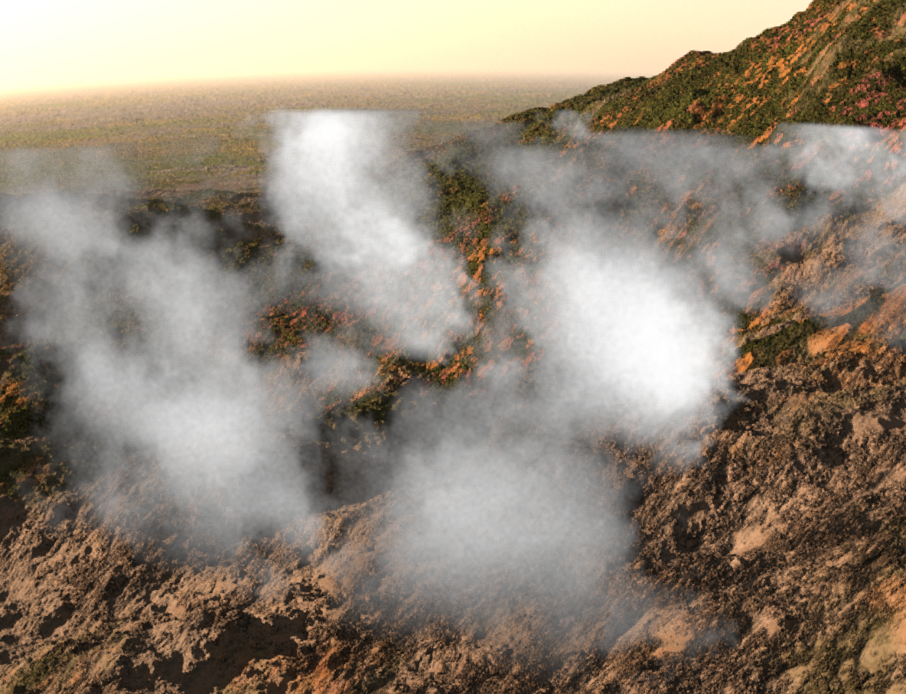

## Volumetric path tracing

 

## Description
A small c++ sample from a volumetric path tracer developed during the Advanced Graphics course at Utrecht University, which implements a large number of features and was as a whole rated "a very impressive package" and received a perfect 10 grade. The ray tracer is typically real time, but not when rendering large volumes. The code implements the core ray processing logic and prototype volumetric raytracing used in cloud rendering based. Note that this is not heavily optimized code nor is it implemented on the gpu, nor necessarily high quality code in general but rather experimental. Feel free to use copy, use as inspiration or a learning tool to understand volumetric raytracing. 

Edit: included some images. May further add main rendering pipeline, custom BVH datastructure and cloud noise generator, noise reduction, filters, all of the other goodies later. 
However another party has contributed to some of that work so I will not make it public at this time.

